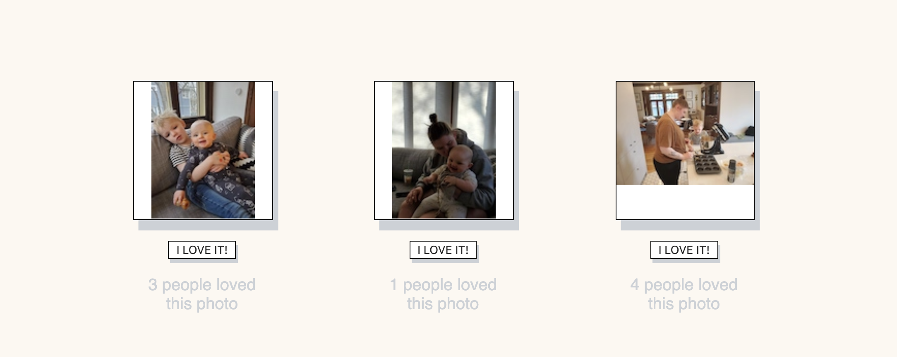

The Life Gallery:

This picture gallery application is designed for displaying images and collecting user feedback.

The images and feedback buttons are similarly styled to tell intuitive users that both are interactive

Images areas can be clicked to switch back and forth between images and descriptions.
The button creates a running tally of how many users appreciated the image.

Understanding that most modern users will be uploading most of their photos from their phones our styling allows for pictures in both portrait and landscape orientation to be displayed in a manner reminiscent of old Polaroids.

The free version of this app comes with the "harmony" color scheme shown here. More color schemes and options will be available in our paid version, coming soon.

